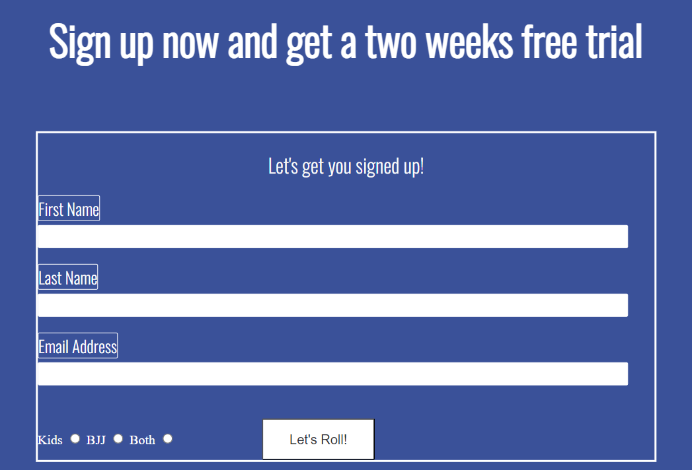
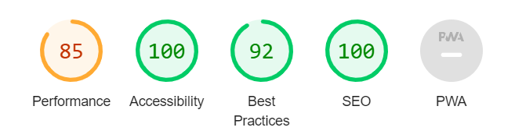

# Join BJJ

Have you ever thought about how you would handle a stressful situation? Have you ever had a fullgrown man trying his best to either break your arm or to chooke you? Learning to deal with extreme pressure will help you to thrive in many aspects of life. The goal of this website is to make people step out of their comfort zone, join the fastest growing combatsport in the world and build som muscles. 

In the process you will evolve as a person and new avenues in life will open up. If you have never tried BJJ than consider this a call to come to the club and experience it first hand. You will not be disappointed. 

  

## Features

The features included on the page are essential to a attractive website that is both informative and personal. 

- Feature 1: Navigation Bar

To easily aid the website user the navigation bar is located inside the header on all pages. Inside the header there is also a image with a text displayed on it. The navigation bar contains the options of Home, Join and Gallery with links to the respective pages. In this way the user can quickly navigate around the pages without the need of having to go back a page.  

 

- Feature 2: Club Message
  
  The club message section of the homepage is intended to inspire the user to take the decision to try a training session. It is divided into three parts. The right and left sections that contain the texts. The middle section that contains the montage of group images. 

  

- Feature 3: Schedual

The schedual section of the homepage gives the user a quick access to important information. A clubs schedual is one of the first bits of info a new possible student would like to know. With the schedual a user can plan a possible visit and make more pemanent decisions further on.

 

- Feature 4: Footer

The footer is a simplistic and consistent part of all the pages. It contains the links to the social networks where a user can choose to connect with the club in a more convinient way. It also tells the clubs physical adress. 

- Feature 5: Gallery

The gallery section felt like a very obvious page to include. To give the website user the chance of viewing actual photos from the clubs training sessions, sparring and competition enhances the chances for a connection and a call to action. A picture says more then a thousands words. It is conviniently placed inside the navigation bar.

- Feature 6: Join

To feature a join page gives the user the oppurtunity to sign up for a two week free training pass. It also gives the chance to sign up the rest of the family as well. It too is placed conviniently inside the navigation bar. 

## Testing

This site has a couple of feautures that required testing. 

- Navigation Bar
  
  The navigation bar has links to three different pages. They all work correctly and provides with the oppurtunity to easily navigate around. 

- Footer
  
  The footer section contains four correctly working links to the social media networks instagram, twitter, youtube and facebook. 

- Join
  
  The join page has a sign up form that only allows you to enter the correct type of answers and forward it correctly. 

- Validator Testing
  
  - No HTML errors were returned when passing threw the [W3C validator](https://validator.w3.org/)

  
  - No CSS errors were returned when passing threw the [W3C validator](https://validator.w3.org/)
  - I checked how accessible the page is by running it threw Lighthouse in devtools.   

-  Bugs
   - The middle section of club-message containing the images was a bit of a challenge in the beginning. With some trial an error i got the wanted outcome by changing the display to flex.   
   -  A reccuring bug that made it impossible to affect with CSS code was the lacking of the link element in the HTML structure. The first time it happened I spend some time to figure out the problem. When it became clear that nothing happened when I typed in CSS code, I understood that there must be a problem with linking. 
    -  When fitting the contents to smaller screen sizes I noticed that the navigation bar content appeared partly on top of each other. I knew that the solution had to be within the media queries css code. After some trial and error I found the solution within the line-height property of the navigation bar menu. 
   -  When going threw the README file I noticed that the lastname label on signup form appeared above the wrong input field. At first I was convinced that the problem was within the HTML structure. But after going threw it I finally solved within the CSS code. I changed the font-size. 
- Unfixed Bugs  
  -  There are no unfixed bugs.
  
  
  
  

## Deployment

This site was regularly pushed to Github and deployed to Github pages. The deployment followed these steps. 

1, Pushing the code to Github.

2, In the Github repository, navigate to the settings tab. 

3, From the source section drop-down menu select the main-branch. Wait a minute for the link to upload. 

The live link to the website is [here](https://validator.w3.org/)

## Credits

- Content
  
  - The fonts used in this project are Oswald and Roboto. The inspiration to use this pair came from fontpair.co
 
  - The color combinations used in this project is titled "Sleek & Modern" and came from canva.com/learn/100-color-combinations/ I choose these colors because i felt that they would work with the overall themes and colors coming from the images. 
   - The inspiration behind the header comes from the Love Running project. I thought that I could rearrange navigation bar so that it appeared in a column. 
  - The inspiration and HTML structure behind the club-message section comes from the Love Running project. I liked the structure and wanted to change the middle section to images stacked on top of each other. By transforming what I had learned from the Love Running project I tested my new skills.To the middle section of the club message page I found the youtube course provided by SuperSimpleDev on HTML and CSS to be helpful. Heres is the adress to that course <https://www.youtube.com/watch?v=G3e-cpL7ofc&t=13846s>
  - The schedual section HTML comes from the times section of the Love Running project. The HTML and CSS code are tweaked to fit in to the new page. The background image is removed and instead a color is inserted. 
  - The gallery page HTML and CSS comes from <https://blog.logrocket.com/responsive-image-gallery-css-flexbox/> It is tweaked to in size and CSS. To the gallery page I have had found the youtube course provided by SuperSimpleDev on HTML and CSS to be helpful. Heres is the adress to that course <https://www.youtube.com/watch?v=G3e-cpL7ofc&t=13846s>
  - The HTML and CSS structure of the footer comes from the Love Running projects same section. It is changed in its size, color and content.  
  - The HTML and CSS structure of the sign up form on the join page is taken from the Love Running project. It is changed in its color, size and content. 

- Media
  
 
   - The images provided are from the social media pages of my BJJ club Team Leites Stockholm.  

