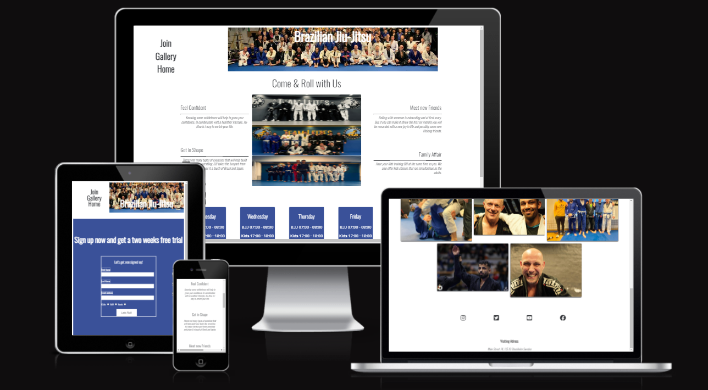
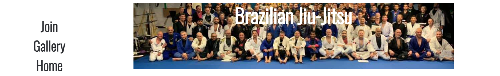
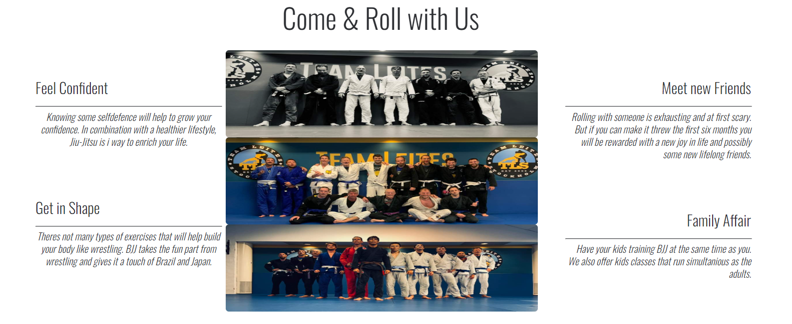
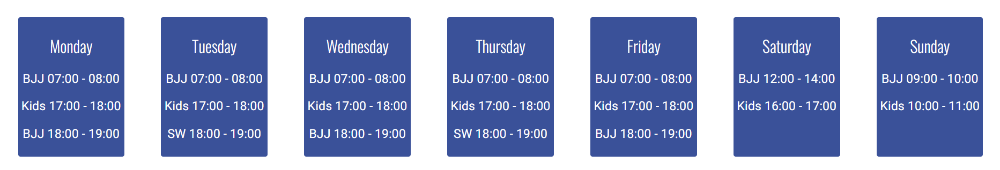
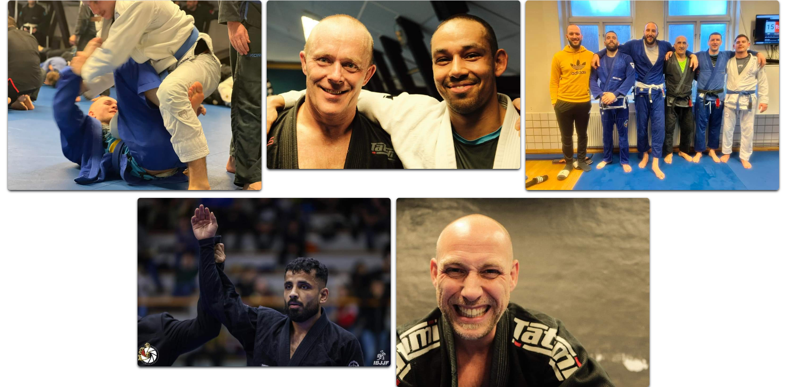
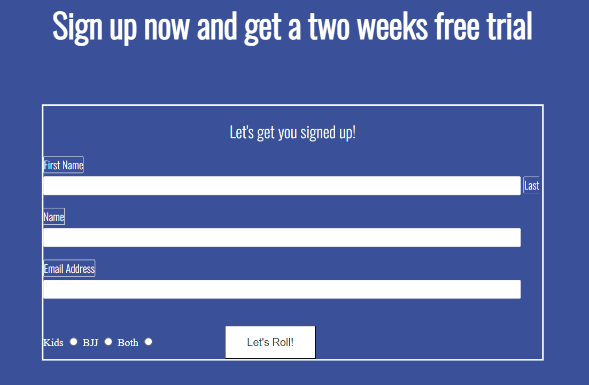

# Join BJJ

Have you ever thought about how you would handle a stressful situation? Have you ever had a fullgrown man trying his best to either break your arm or to chooke you? Learning to deal with extreme pressure will help you to thrive in many aspects of life. The goal of this website is to make people step out of their comfort zone, join the fastest growing combatsport in the world and build som muscles. 

In the process you will evolve as a person and new avenues in life will open up. If you have never tried BJJ than consider this a call to come to the club and experience it first hand. You will not be disappointed. 

  

## Features

The features included on the page are essential to a attractive website that is both informative and personal. 

- Feature 1: Navigation Bar

To easily aid the website user the navigation bar is located inside the header on all pages. Inside the header there is also a image with a text displayed on it. The navigation bar contains the options of Home, Join and Gallery with links to the respective pages. In this way the user can quickly navigate around the pages without the need of having to go back a page.  

 

- Feature 2: Club Message
  
  The club message section of the homepage is intended to inspire the user to take the decision to try a training session. It is divided into three parts. The right and left sections that contain the texts. The middle section that contains the montage of group images. 

  

- Feature 3: Schedual

The schedual section of the homepage gives the user a quick access to important information. A clubs schedual is one of the first bits of info a new possible student would like to know. With the schedual a user can plan a possible visit and make more pemanent decisions further on.

 

- Feature 4: Footer

The footer is a simplistic and consistent part of all the pages. It contains the links to the social networks where a user can choose to connect with the club in a more convinient way. It also tells the clubs physical adress. 

- Feature 5: Gallery

The gallery section felt like a very obvious page to include. To give the website user the chance of viewing actual photos from the clubs training sessions, sparring and competition enhances the chances for a connection and a call to action. A picture says more then a thousands words. It is conviniently placed inside the navigation bar.

- Feature 6: Join

To feature a join page gives the user the oppurtunity to sign up for a two week free training pass. It also gives the chance to sign up the rest of the family as well. It too is placed conviniently inside the navigation bar. 

## Testing

This site has a couple of feautures that required testing. 

- Navigation Bar
  
  The navigation bar has links to three different pages. They all work correctly and provides with the oppurtunity to easily navigate around. 

- Footer
  
  The footer section contains four correctly working links to the social media networks instagram, twitter, youtube and facebook. 

- Join
  
  The join page has a sign up form that only allows you to enter the correct type of answers and forward it correctly. 

- Validator Testing
  
  - No HTML errors were returned when passing threw the [W3C validator](https://validator.w3.org/)

  
  - No CSS errors were returned when passing threw the [W3C validator](https://validator.w3.org/)
  
  
  

## Deployment

This site was regularly pushed to Github and deployed to Github pages. The deployment followed these steps. 

1, Pushing the code to Github.

2, In the Github repository, navigate to the settings tab. 

3, From the source section drop-down menu select the main-branch. Wait a minute for the link to upload. 

The live link to the website is [here](https://validator.w3.org/)

## Credits

- Content
  
  The navigation bar has links to three different pages. They all work correctly and provides with the oppurtunity to easily navigate around.

- Media
  
  The footer section contains four correctly working links to the social media networks instagram, twitter, youtube and facebook.

